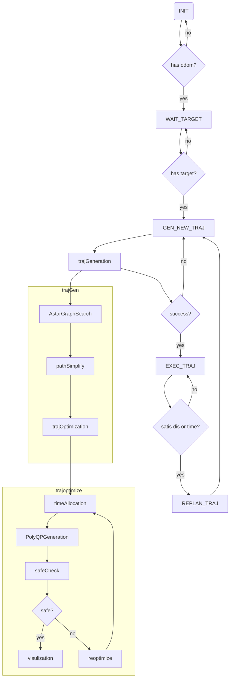
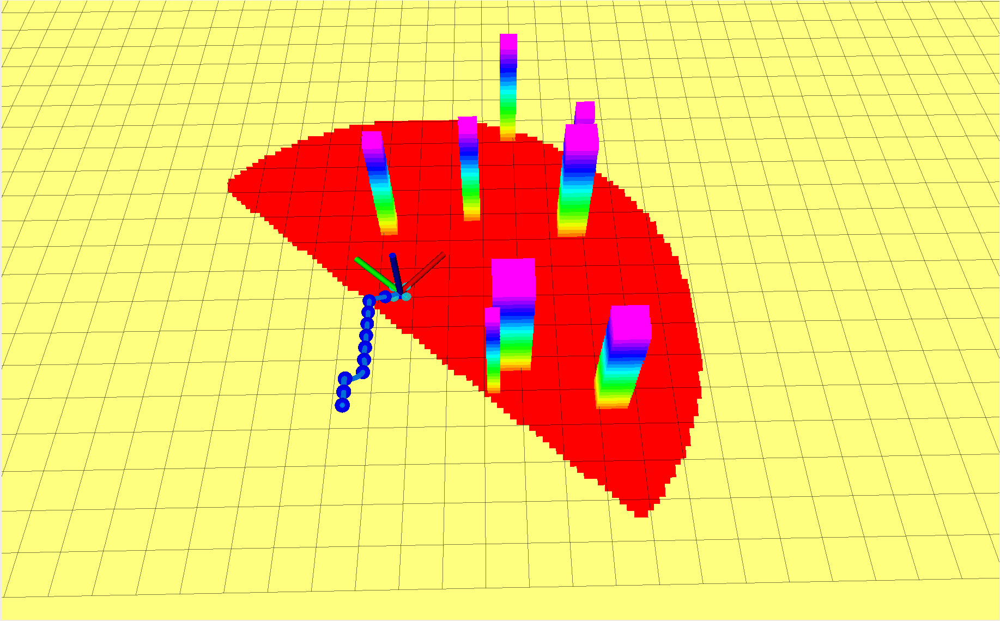
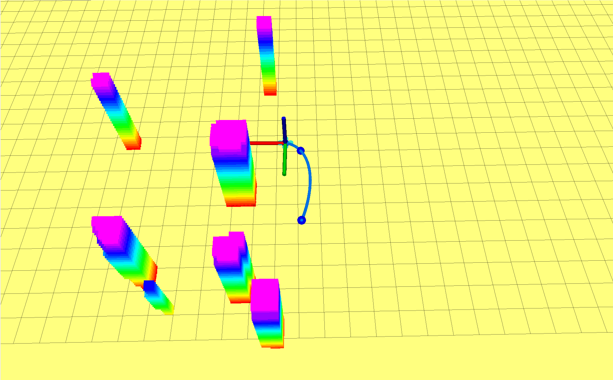
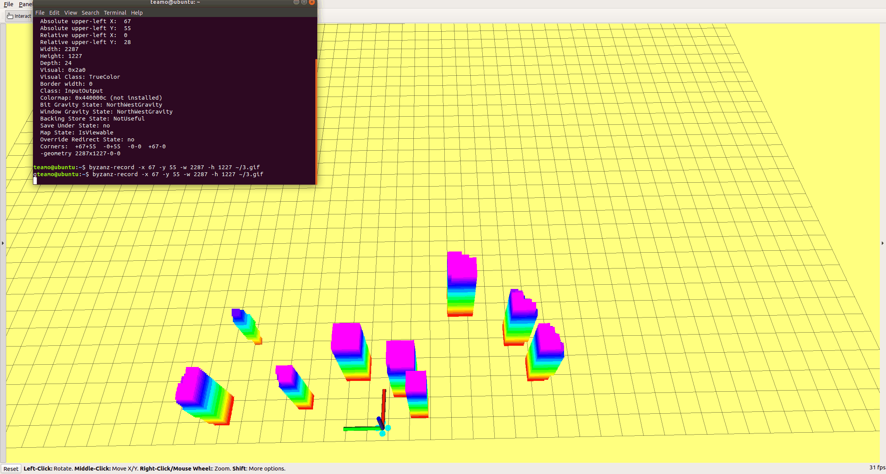

# 移动机器人运动规划课程大作业

## trajectory_generator_node运行流程图



在流程图中只对于流程函数进行了展示

## 关键函数实现

### path planning

使用Astar算法实现，具体函数与之前的作业代码一致

### simplify the path

使用RDP算法实现，代码如下：

```cpp
// 计算一点到一条直线（已知两点）的距离
//first和last分别为线的两端，third是第三点
double AstarPathFinder::disP2L(const Vector3d first, const Vector3d last, const Vector3d third) 
{
  Vector3d nu = (third - first).cross(third - last);
  Vector3d de = first - last;
	double disSuqare = nu.norm()/de.norm();
	return disSuqare;
}


vector<Vector3d> AstarPathFinder::pathSimplify(const vector<Vector3d> &path,
                                               double path_resolution) {
  vector<Vector3d> subPath;

  if (path.size() <= 2)
  {                            // 如果轨迹中的点数小于2，则直接返回原来的轨迹
    subPath = path;
  }else
  {
    const Vector3d first = path[0];                 //定义首点
	  const Vector3d last = path[path.size() - 1];    //定义尾点

    int flag = 0;                             //标记距离最大的点的下标
	  double disSquare = 0;

    for (int i = 1; i< path.size() - 1; i++) {
      double temp = disP2L(first, last, path[i]);
      if (temp > disSquare) {                    //记录最大距离及编号
        disSquare = temp;
        flag = i;
      }
    }

    if (disSquare < path_resolution) {                      //判断值与阈值的关系,阈值自己设定
      subPath.push_back(first);                             //如果小于阈值，则保留首尾点
      subPath.push_back(last);              
                                                            //用于存储留下来的点,是最后的结果
    }
    else {                                                    //否则分成两段
		vector<Vector3d> recResults1 = pathSimplify(vector<Vector3d>(path.begin(),path.begin()+flag), path_resolution);
    vector<Vector3d> recResults2 = pathSimplify(vector<Vector3d>(path.begin()+flag,path.end()), path_resolution);
    subPath.insert(subPath.end(),recResults1.begin(),recResults1.end()-1);
    subPath.insert(subPath.end(),recResults2.begin(),recResults2.end());
	  }
  }
  // return subPath;
  return subPath;
}
```

代码参考提供的伪代码，使用递归的方式实现，这里的path_resolution为0.2，与grid_map的分辨率相同，这个算法的效果在这个分辨率下与jps算法是一致的。未简化和简化之后的效果如下图所示:

| 未简化              | 简化                |
| ------------------- | ------------------- |
|  |  |

从图中可以看出，简化后的路径大大减少了路径约束点的个数，使得规划出的轨迹更加光滑，同时也可以允许无人机在更长的时间内以最大速度飞行。此外，由于分辨率的选择，简化后的路径连接后依旧保留了原本路径的无碰撞的特性，这个是后续在简化后路径上进行重优化的必要条件。

### trajectory optimization

使用基于osqp求解器的minisnap轨迹生成，具体函数与之前的作业代码一致

### safe checking

根据生成的多项式系数和时间分配检测生成的轨迹是否存在某一段与障碍物存在碰撞，具体代码如下：

```c++
int AstarPathFinder::safeCheck(MatrixXd polyCoeff, VectorXd time) {
  int unsafe_segment = -1; //-1 -> the whole trajectory is safe
  Vector3d pos;
  for (int i = 0; i < time.size(); i++) {
    for (double t = 0.0; t < time(i); t += 0.01) {
      pos = getPosPoly(polyCoeff, i, t);
      if(isOccupied(coord2gridIndex(pos))){
        return i;
      }

    }
  }
  return unsafe_segment;
}
```

### trajectory reoptimization

使用论文中提到的方法，对于碰撞段的中点添加约束点并重新规划，直到不存在碰撞段为止，具体的代码如下:

```c++
while (unsafe_segment != -1) {
    std::cout << unsafe_segment << std::endl;
    /**
     *
     * STEP 3.4:  reoptimize
     * the method comes from: "Polynomial Trajectory
     * Planning for Aggressive Quadrotor Flight in Dense Indoor Environment"
     * part 3.5
     *
     * **/
    // 轨迹重新规划
    Eigen::Vector3d start = repath.row(unsafe_segment);
    Eigen::Vector3d end = repath.row(unsafe_segment + 1);
    Eigen::Vector3d mid = (start + end)/2;
    Eigen::MatrixXd tmp(int(repath.rows()+1),3);
    std::cout << mid << std::endl;
    tmp.block(0,0,unsafe_segment + 1,3) = repath.block(0,0,unsafe_segment + 1,3);
    tmp.row(unsafe_segment+1) = mid;

    tmp.block(unsafe_segment + 2,0,int(repath.rows()- unsafe_segment - 1),3) = repath.block(unsafe_segment + 1,0,int(repath.rows()- unsafe_segment - 1),3);

    repath = tmp;

    _polyTime = timeAllocation(repath);
    _polyCoeff =
      _trajGene->PolyQPGeneration(_dev_order, repath, vel, acc, _polyTime,slover);
    unsafe_segment = _astar_path_finder->safeCheck(_polyCoeff, _polyTime);
  }
```

添加重规划后的算法可以保证在整个轨迹上无碰撞，对比图由于传感器的范围所限，很难具体捕捉到某一重优化之前轨迹碰到障碍物的情况，所以就不具体截图对比了。具体的效果可以参看最后的结果展示部分。

## 结果展示



从图中可以看出demo运行是没有问题的，但是在调试过程中发现了一些以后可以改进的地方，比如若指定的目标点超过传感器的范围，当到达目标点时可能会发现目标点是在障碍物里面的，这时就会导致在目标点约束的情况下重优化是无解的。其次，传感器的更新频率有些跟不上无人机的运行速度，导致偶尔可能会出现在收到传感器反馈的障碍物信息之前就已经碰到障碍物。

